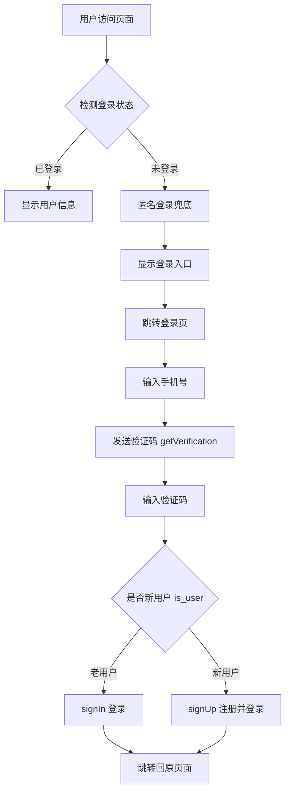

## 产品概述

为现有 Chris Know 博客系统添加完整的用户注册/登录体系，使用 CloudBase Auth v2 的手机号短信验证码方式（腾讯云短信），替代当前的匿名登录方案。

## 核心功能

### 一、手机号短信验证码登录/注册

- 用户输入手机号，点击"发送验证码"，收到短信验证码后输入并登录
- 新用户首次验证自动注册并登录（一键注册登录合一）
- 老用户直接短信验证码登录
- 验证码发送按钮 60 秒倒计时防重复

### 二、用户状态管理

- 全局 AuthContext 管理登录状态（当前用户、是否已登录、加载中）
- 页面初始化时自动检测已有登录状态，已登录用户无需重复登录
- 未登录用户自动降级为匿名登录，保持现有功能可用
- 监听登录状态变化（token 失效时提示重新登录）

### 三、Header 用户入口

- 导航栏右侧显示用户头像/登录按钮
- 已登录：显示用户头像和昵称，点击展开下拉菜单（个人中心、退出登录）
- 未登录：显示"登录"按钮，点击跳转登录页

### 四、登录/注册页面

- 独立 `/login` 路由页面
- 手机号输入 + 验证码输入的表单
- 发送验证码按钮带倒计时
- 登录成功后自动跳转回之前页面
- 延续博客 Editorial 设计风格，精美的视觉效果

### 五、用户个人中心页面

- 独立 `/profile` 路由页面
- 显示用户基本信息（手机号、昵称、头像）
- 支持修改昵称和头像
- 退出登录功能

## 技术栈

基于现有项目扩展，无需引入新框架：

- **前端框架**: React 18 + TypeScript
- **路由**: react-router-dom（HashRouter）
- **认证 SDK**: @cloudbase/js-sdk（已安装，使用 Auth v2 API）
- **样式**: Tailwind CSS 3.4 + 现有 CSS 变量体系
- **图标**: lucide-react（已安装）
- **构建**: Vite 5
- **后端**: CloudBase（认证 + NoSQL 数据库）

## 技术方案

### 1. 认证架构



### 2. 认证流程（基于 CloudBase Auth v2 Web SDK）

**核心流程采用 skill:auth-web-cloudbase 的 Scenario 5（注册/登录合一）**：

1. 发送验证码：`auth.getVerification({ phone_number: "+86 xxx" })`
2. 验证验证码：`auth.verify({ verification_id, verification_code })`
3. 判断新旧用户：通过 `verification.is_user` 判断
4. 老用户登录：`auth.signIn({ username, verification_token })`
5. 新用户注册：`auth.signUp({ phone_number, verification_code, verification_token, name })`

**关键约束**：

- "发送验证码"和"验证码登录"必须拆分为两步，第二步复用第一步返回的 `verificationInfo`，不能重复调用 `getVerification`
- SDK 初始化必须同步，不能用动态 import 或 async 包装

### 3. 全局状态设计

创建 `AuthContext`，参考现有 `ThemeContext` 的 Context 模式：

```typescript
interface AuthUser {
  uid: string;
  phone: string;
  name: string;
  picture: string;
}

interface AuthContextType {
  user: AuthUser | null;
  isLoggedIn: boolean;
  loading: boolean;
  login: () => void;      // 跳转登录页
  logout: () => Promise<void>;
  refreshUser: () => Promise<void>;
}
```

### 4. cloudbase.ts 改造

保留匿名登录作为兜底方案，新增用户登录状态检测：

- 页面加载时先检查 `auth.getCurrentUser()`
- 如有用户则直接使用，如无则走匿名登录
- 登出时回退到匿名登录状态

### 5. 数据库设计

扩展用户信息存储到 `blog_users` 集合（CloudBase 自带用户表只有基础字段）：

```typescript
interface BlogUser {
  _id: string;        // CloudBase uid
  phone: string;
  nickname: string;
  avatar: string;
  bio: string;
  createdAt: string;
  updatedAt: string;
}
```

安全规则：CUSTOM（用户只能读写自己的数据）

## 实现要点

### 性能

- AuthContext 初始化时先读 `getCurrentUser()`，避免每次刷新重新登录
- 用户信息缓存到 Context，减少重复请求
- 登录页懒加载，不影响首屏

### 兼容性

- 未登录用户仍可浏览文章、查看评论等公开功能（匿名登录兜底）
- 评论、留言等功能后续可关联用户身份，当前不改动已有逻辑

### 安全

- 手机号格式前端校验（11位数字）
- 验证码 60 秒倒计时防刷
- 敏感操作（如注销账号）需二次确认

## 目录结构

```
src/
├── config/
│   └── cloudbase.ts                    # [MODIFY] 改造认证初始化，支持用户登录状态检测
├── contexts/
│   └── AuthContext.tsx                  # [NEW] 全局认证状态管理 Context，提供 user/login/logout/refreshUser
├── services/
│   └── authService.ts                  # [NEW] 封装 CloudBase Auth API：发送验证码、验证码校验、注册/登录、登出、获取用户、更新资料
├── pages/
│   └── LoginPage.tsx                   # [NEW] 登录/注册页面，手机号+验证码表单，倒计时，登录后跳转
│   └── ProfilePage.tsx                 # [NEW] 用户个人中心页面，显示/编辑昵称头像，退出登录
├── components/
│   └── auth/
│       └── UserMenu.tsx                # [NEW] Header 右侧用户菜单组件，已登录显示头像下拉菜单，未登录显示登录按钮
├── types/
│   └── index.ts                        # [MODIFY] 新增 AuthUser、BlogUser 等类型定义
├── App.tsx                             # [MODIFY] 添加 AuthProvider 包裹，新增 /login /profile 路由
├── components/layout/Header.tsx        # [MODIFY] 集成 UserMenu 组件到导航栏右侧
```

## 设计风格

延续博客现有的 Editorial 极简风格，登录页面采用居中卡片式布局，营造简洁、高端的品质感。

### 登录/注册页面

- **整体布局**：全屏居中，左侧装饰区域（渐变背景 + 博客标语），右侧登录表单卡片
- **移动端**：单列布局，仅显示表单卡片，顶部带博客 Logo
- **表单卡片**：圆角卡片，柔和阴影，玻璃拟态效果（dark 模式下半透明背景 + backdrop-blur）
- **手机号输入**：带 +86 前缀标识，大尺寸输入框，聚焦时底部边框变为主题色
- **验证码区域**：输入框 + 发送按钮并排，发送后按钮显示倒计时数字，按钮变为 disabled 灰色态
- **登录按钮**：全宽主题色（#D4A574）渐变按钮，hover 时微微上浮 + 阴影加深，loading 状态显示旋转动画
- **底部提示**：灰色小字"未注册的手机号将自动创建账号"

### Header 用户入口

- **未登录**：导航栏右侧显示"登录"文字按钮，hover 变为主题色
- **已登录**：显示圆形用户头像（36px），hover 时显示下拉菜单
- **下拉菜单**：圆角浮层，带阴影，包含用户昵称、个人中心链接、退出登录按钮，菜单项 hover 背景色变化

### 个人中心页面

- **顶部区域**：大头像（80px）+ 昵称 + 手机号（部分隐藏 138****0000）
- **信息编辑**：卡片式布局，昵称输入框 + 保存按钮
- **退出按钮**：底部红色边框按钮，带确认弹窗

### 动效设计

- 登录卡片入场：从下方 slide-up 淡入
- 验证码发送成功：按钮文字平滑切换为倒计时
- 登录成功：按钮变为绿色打勾图标，0.5 秒后跳转
- 下拉菜单：scale + opacity 过渡动画

## Agent Extensions

### Skill

- **auth-web-cloudbase**
- Purpose: 提供 CloudBase Auth v2 Web SDK 的完整短信登录/注册 API 用法，确保 getVerification / verify / signUp / signIn 等接口调用正确
- Expected outcome: 前端认证逻辑完全基于官方 SDK 文档实现，API 调用正确无误

- **web-development**
- Purpose: 遵循 Web 前端开发规范，确保 SDK 初始化、路由、部署等符合最佳实践
- Expected outcome: 项目结构规范，构建部署流程正确

- **cloudbase-platform**
- Purpose: 指导 CloudBase 控制台配置（短信登录启用、安全域名、数据库权限）
- Expected outcome: 控制台配置正确，认证功能可正常使用

### Integration

- **tcb**
- Purpose: 创建 blog_users 数据库集合、配置安全规则、部署前端到静态托管
- Expected outcome: 数据库集合创建成功，安全规则配置正确，前端部署上线